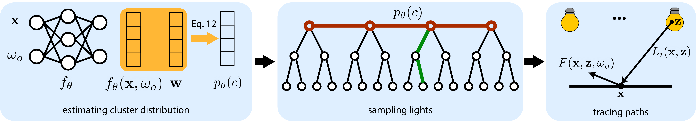

# Neural Importance Sampling of Many Lights

### [Paper](https://arxiv.org/pdf/2505.11729) | [Project Page](https://pedrovfigueiredo.github.io/projects/manylights/SIGGRAPH_2025_Importance_Sampling/index.html)

This is the official implementation of the paper, titled "Neural Importance Sampling of Many Lights", to be presented at ACM SIGGRAPH 2025 (conference track).

 <br/>
We propose a hybrid neural approach for estimating spatially varying light selection distributions in rendering with many lights.

## Abstract
We propose a neural approach for estimating spatially varying light selection distributions to improve importance sampling in Monte Carlo rendering, particularly for complex scenes with many light sources. Our method uses a neural network to predict the light selection distribution at each shading point based on local information, trained by minimizing the KL-divergence between the learned and target distributions in an online manner. To efficiently manage hundreds or thousands of lights, we integrate our neural approach with light hierarchy techniques, where the network predicts cluster-level distributions and existing methods sample lights within clusters. Additionally, we introduce a residual learning strategy that leverages initial distributions from existing techniques, accelerating convergence during training. Our method achieves superior performance across diverse and challenging scenes in equal-sample settings.


## News
- **2025.06.26**: Repo is released.
- **2025.07.14**: Source code is released.

## Dependencies
- NVIDIA GPU (Turing or higher, with ray tracing support)
- OptiX 7.0+ and CUDA 12+

This project is tested with OptiX 7.4, CUDA 12.4, NVIDIA RTX 4090, on Windows 11 (MSVC).

## Scenes
You can download the seven scenes used in the main comparisons from the following link: [scenes download](https://drive.google.com/file/d/1mvbsHQxwWaoXRJ_06cakmE3jkLZEKw0i/view?usp=drive_link).
Once downloaded, extract the scenes into the `common` directory, so that the directory structure looks like this:
```
common/
|── scenes/
```

## Building
We inherit the code base from pbrt-v4, which uses git submodules for a number of third-party libraries
that it depends on.  Therefore, be sure to use the `--recursive` flag when
cloning the repository:
```bash
$ git clone --recursive https://github.com/pedrovfigueiredo/nis-manylights
```

We use [cmake](http://www.cmake.org/) for our build system.  Note that a
release build is the default; provide `-DCMAKE_BUILD_TYPE=Debug` to cmake
for a debug build.

Before compiling, you need to set the correct `CMAKE_CUDA_ARCHITECTURES` for your GPU in the `CMAKELists.txt` at root directory of the project. By default, it is set to `89` for the NVIDIA RTX 4090. Consult [NVIDIA's documentation](https://developer.nvidia.com/cuda-gpus) for the correct architecture code for your GPU.

Please make sure cuda is installed and added to PATH. While it tries to guess the optix installation path (i.e., the default installation directory on Windows), you may specify the `OptiX_INSTALL_DIR` environment variable manually in case it failed.

## Running
We provide a helper script to run the code.
```bash
python src/scripts/run_experiments_cmd.py
```

In the script, you can specify the scene(s) to run multiple ones in sequence by modifying `test_scenes`. Command-line options include:

- `exe`: Path to the executable (default: `.\\build\\Release\\pbrt.exe`)
- `output_dir`: Base output directory (default: `.\\common\\outputs`)
- `lightsampler`: Method name(s), separated by commas if multiple (e.g. `bvh,neural_slcadt`)
- `budget_type`: Type of training budget, either `spp` (samples per pixel) or `time` (seconds) (default: `spp`)
- `budget_value`: Number of seconds or samples for training budget (default: `256`)
- `max_depth`: Maximum depth used for rendering (default: `1`). In the paper, we render direct illumination only (1-step)
- `train_budget_ratio`: Training budget ratio(s), comma separated if multiple (e.g. `0.15,0.2`) (default: `0.15`)
- `n_runs`: Number of runs for each scene (default: `1`). This is useful for computing the average and standard deviation over multiple runs.
- `experiment_name`: Experiment name (default: `sample_exp`)
- `intermediate_output_frequency`: Frequency of outputting intermediate results (default: `-1`, which means no intermediate output)
- `resolution`: Overwrite scene's resolution of the output image (e.g. `1280x720`)
- `show_display_server`: Show display server while rendering (default: `False`). This launches a display server that can be used in conjunction with viewers such as [tev](https://github.com/Tom94/tev) to visualize the rendering progress (see [pbrt-v4 documentation](https://github.com/mmp/pbrt-v4) for more information)
- `log_verbose`: Write verbose log (default: `False`).

These options are applied as a combination of command-line arguments from pbrt-v4 (e.g. `--show_display_server`) and modification of scene files, creating temporary ones for each experiment (e.g. overwriting the lightsampler method).

### Lightsampler Methods
This release includes the following lightsamplers:
- `uniform`: Uniform Random Sampling
- `power`: Power Heuristic Sampling
- `bvh`: Adaptive Tree Splitting (ATS) [[Estevez and Kulla 2018](https://dl.acm.org/doi/10.1145/3233305)]
- `slc`: Stochastic Lightcuts (SLC) [[Yuksel 2019](https://www.cemyuksel.com/research/stochasticlightcuts/)]
- `slcrt`: Real-Time Stochastic Lightcuts (SLCRT) [[Lin and Yuksel 2020](https://dl.acm.org/doi/10.1145/3384543)]
- `varl_slc`: Learning to Cluster for Rendering with Many Lights [[Wang et al. 2021](https://dl.acm.org/doi/10.1145/3478513.3480561)] using SLC clustering heuristic
- `varl_slcrt`: Learning to Cluster for Rendering with Many Lights [[Wang et al. 2021](https://dl.acm.org/doi/10.1145/3478513.3480561)] using SLCRT clustering heuristic
- `varl_slcats`: Learning to Cluster for Rendering with Many Lights [[Wang et al. 2021](https://dl.acm.org/doi/10.1145/3478513.3480561)] using ATS clustering heuristic
- `neural_slc`: Neural Importance Sampling of Many Lights [[Figueiredo et al. 2025](https://pedrovfigueiredo.github.io/projects/manylights/SIGGRAPH_2025_Importance_Sampling/index.html)] using SLC clustering heuristic
- `neural_slcrt`: Neural Importance Sampling of Many Lights [[Figueiredo et al. 2025](https://pedrovfigueiredo.github.io/projects/manylights/SIGGRAPH_2025_Importance_Sampling/index.html)] using SLCRT clustering heuristic
- `neural_slcats`: Neural Importance Sampling of Many Lights [[Figueiredo et al. 2025](https://pedrovfigueiredo.github.io/projects/manylights/SIGGRAPH_2025_Importance_Sampling/index.html)] using ATS clustering heuristic

For our results in the paper, we use `neural_slcats`.<br/>
Note that our implementation of Learning to Cluster for Rendering with Many Lights [[Wang et al. 2021](https://dl.acm.org/doi/10.1145/3478513.3480561)] was modified from the original to work with the GPU. This implementation achieves higher performance even for equal-sample settings, compared to the original CPU implementation (see Sec. 1 of the [supplementary](https://pedrovfigueiredo.github.io/projects/manylights/SIGGRAPH_2025_Importance_Sampling/media/SIGGRAPH_2025_Importance_Sampling_supp.pdf)).

### Additional settings
You are welcome to investigate the different options under the `src/pbrt/lightsamplers_constants.h` configuration file. Some of the notable options include:
- `NEURAL_HEIGHT`: Height (k in the paper) at which we compute the cut over the light tree. By default, we set it to 6, as it works best for most of our scenes. Note that this directly affects the output dimension of the network.
- `RESIDUAL_LEARNING`: Turn on/off our residual learning strategy (Sec. 4.3 in the paper).
- `VPL_USED`: Toggle whether to set up code for scenes with virtual point lights or not. By default, it is set to `false`, as most scenes do not use VPLs. To render scenes with VPLs (e.g. `San Miguel`), make sure to set it to `true`.
- `NEURAL_GRID_DISCRETIZATION`: Turn on discrete inputs on a grid to the network (`Effect of Continuous Representation` ablation in the paper). Note that you can modify the spatial and directional resolution of this discretization by changing `POSITIONAL_DISCRETIZATION_RESOLUTION` and `DIRECTIONAL_DISCRETIZATION_RESOLUTION` respectively.
- `NEEONLY`: Toggle between direct illumination only (main results in the paper) or global illumination via path tracing with BSDF importance sampling (Sec. 2 of the [supplementary](https://pedrovfigueiredo.github.io/projects/manylights/SIGGRAPH_2025_Importance_Sampling/media/SIGGRAPH_2025_Importance_Sampling_supp.pdf)).

Note that modifying a parameter in this file requires recompilation of the code to take effect.


## Citation
If our work is useful for your research, please consider citing:
```
@inproceedings{NIS_ManyLights_sig25,
    title={Neural Importance Sampling of Many Lights},
    author={Figueiredo, Pedro and He, Qihao and Bako, Steve and Khademi Kalantari, Nima},
    booktitle={ACM SIGGRAPH 2025 Conference Papers},
    year={2025},
    doi = {10.1145/3721238.3730754},
    numpages = {11},
    isbn = {979-8-4007-1540-2/2025/08}, 
}
```

## Acknowledgements
This project was funded in part by the NSF CAREER Award #2238193.
This project is built upon the following open-source projects:
- [Learning to cluster for rendering with many lights](https://dl.acm.org/doi/10.1145/3478513.3480561)
- [pbrt-v4](https://github.com/mmp/pbrt-v4)
- [tiny-cuda-nn](https://github.com/NVlabs/tiny-cuda-nn)
